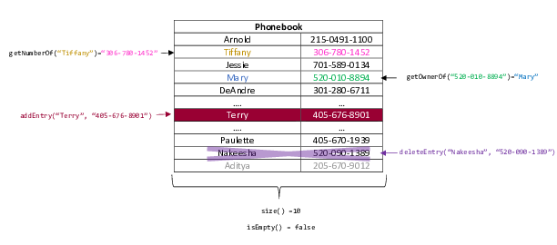
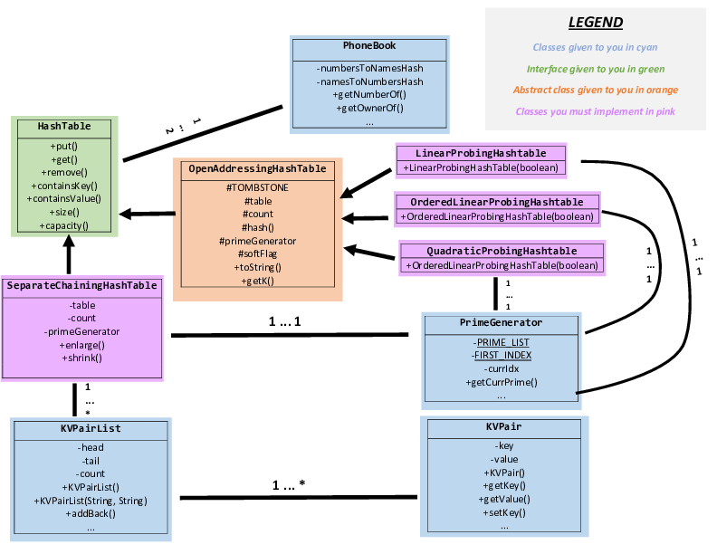
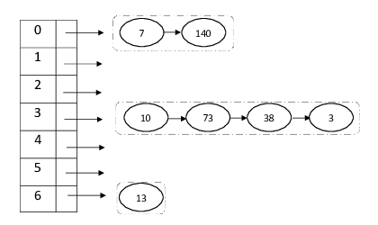
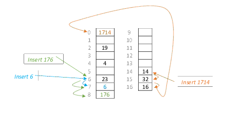
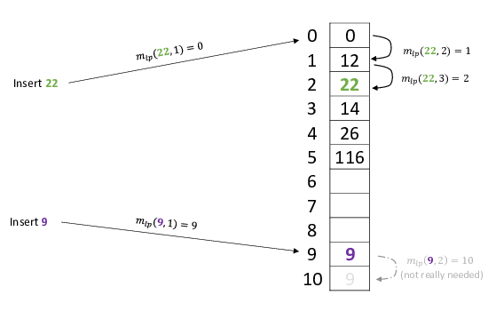
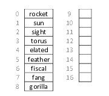
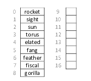
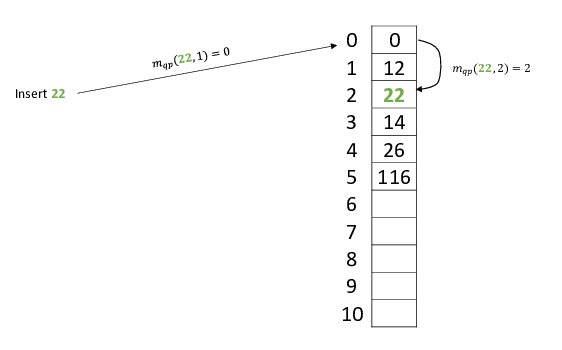
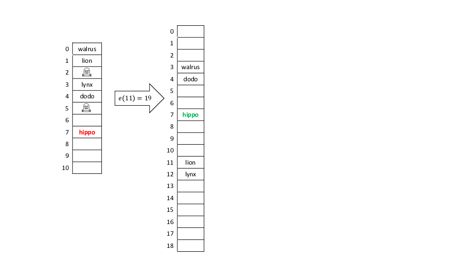
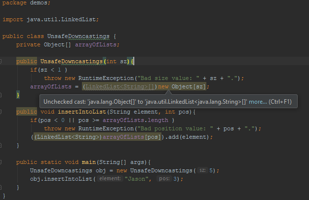

# Hash Tables

## Overview

In this project, you will have to implement an abstraction over a *phonebook*;
a collections of pairs of type `<`*Full_Name*,*Phone_Number*`>`. Your phonebook
will support **both** name-based search and phone-based search. Here is a
pictorial view of the project:



To make both types of searches efficient, your phonebook will internally
maintain **a pair of hash tables** from `String`s to `String`s: One will have
the **person's name as a key** and the **phone number as a value**, and the
other one will have the **phone number as a key** and the **name as a value**!
In your simple phonebook, **entry uniqueness** is **guaranteed**: Every person
has **exactly one** phone number, and every phone number is associated with
**exactly one** person.

## Getting Started

As before, this project is provided to you through a GitLab repository.
If you are viewing this on the web, you should clone your personal
repository. After you have cloned the project, you should study the
JavaDocs and source code provided to understand how your methods
can be used (and tested). The classes you have to implement are
under the package `hashes`.

## Provided Code

### Class hierarchy



The above diagram depicts the code structure for the project. Simple lines
reflect one-to-many "has-a" relations, while arrows show "is-a" relations
(derived class, implemented interface, etc.). The top-level class of the
project is `Phonebook`. What is interesting about `Phonebook` is that
**it has been implemented for you!**
However, the methods of `Phonebook` depend on methods
of the interface `HashTable`, which is implemented (directly or through
`OpenAddressingHashTable`) by the four classes which you will have to implement.
What *you* will need to do is complete the implementation of these four
classes so that their methods can support the methods of `Phonebook`. The
Release Tests **primarily** test methods of `Phonebook` (approximately 90%
of their code), while a smaller number of tests check if you are implementing
basic hash table functionality correctly (e.g. resizings, see below).

The various methods of `Phonebook` will have to run in *amortized constant time*
(except for `size()` and `isEmpty()`, which should run in *constant* time).
This does *not* take into account the case of an insertion or deletion that
results in a *resizing* of the array; we want amortized constant time
*assuming* that a resizing does **not** occur in that particular operation.
We **will** be checking your source code after submission to make sure you
are **not** implementing the methods **inefficiently** (e.g. logarithmic
complexity, linear complexity, or even worse)!

In practice, the only way you can do this is by **not** consulting the hash
function **at all** for your operations; just **looping over the entire table**
until you either find the element (`remove`, `containsKey`) or you find an
empty position (`put`). While this would indeed allow you to pass the tests,
we will be **checking your submission** to make sure you **consult the
hash function!** Implementing all operations as mentioned above would
constrain them to be *linear time*, which is **unacceptable** for both the
project (*ie*, no credit for this project) and Computer Science **as a whole**.
That said, **not all** of the methods you implement make use of the hash
function, which means that their complexity parameters will necessarily be
different. (Can you find any such methods?)

You should fill in the `public` methods of `SeparateChainingHashTable`,
`LinearProbingHashTable`, `OrderedLinearProbingHashTable`, and
`QuadraticProbingHashTable`. For the last three classes, you might find that
some of the methods have the **exact same source code**. You would then
benefit by making them `protected` methods in the `OpenAddressingHashTable`
class, which those three classes extend!

### Interfaces, `abstract` classes, and the `protected` access modifier

In the code base, you might notice that `HashTable` is a Java *interface*.
On the otehr hand, `OpenAddressingHashTable` is an `abstract` class. Abstract
classes in Java are almost like interfaces, except they are allowed to contain
fields and their members do **not** default to `public`. Similarly to
interfaces, one **cannot** instantiate an `abstract` class.

The choice of making `OpenAddressingHashTable` an `abstract` class is
deliberate; several methods and fields of **all** your Openly Addressed hash
tables are common across **all** of these classes. Therefore, it makes sense
to package them into *one place* and debug them in *one place*. Unfortunately,
Java interfaces do **not** allow for storing fields, but only methods, which
are also implicitly `public`. Essentially, the `HashTable` interface tells us
what kinds of methods any `HashTable` instance **ought** to satisfy. For
example, every `HashTable` instance needs to provide a method called `put`,
with two `String` arguments, `key` and `value`, as well as a return value of
type `String`. Refer to the section on *Classes under `utils`* for a short
diatribe on this small class. It should also answer questions of key
containment (`containsKey(String key)`) and queries of its current stored key
count (`size()`) and capacity (`capacity()`).

On the other hand, any Openly Addressed Hash Table needs to have some common
fields and functionality. They all need an array over `KVPair` instances. They
all need to answer queries of size and capacity in $`O(1)`$. They can all
benefit from an overriding of `toString()`, which we provide for you and is
very useful for debugging[^1]. Therefore, this entire piece of common
functionality can (and should) be packages in **one common place**, and this
place in our code base is `OpenAddressingHashTable`.

You might notice that all the fields and methods of `OpenAddressingHashTable`
besides `toString()` are labeled with the `protected` access modifier.
`protected` essentially means: "visible by derived classes". In more detail,
every *identifier* (name) of a field or a method that has been declared
`protected` in a base class can be *straightforwardly* accessed from a derived
class by its name, without any prepending of base class name or of any other
name. This is very useful for your code! You might notice that
`LinearProbingHashTable`, `OrderedLinearProbingHashTable`, and
`QuadraticProbingHashTable`, all classes that you **must** implement, have
**no** `private` **fields** (but if you would like to add some, please go
right ahead). In fact, our own implementation of the project does not add any
extra fields in the classes (but we **do** use `private` methods for
readability).

This is, of course, **not** a perfect approach towards building this code
base. For example, you might notice that `SeparateChainingHashTable`, the only
collision resolution method you have to implement that is not an Open
Addressing method, *necessarily* has to declare some `private` fields that
we also see in `OpenAddressingHashTable`. Also, somebody can argue that since
`OrderedLinearProbingHashTable` has so many common characteristics (the
*Collision Resolution Methods* section analyzes this in some detail) with
`LinearProbingHashTable`, one could make the former a subclass of the latter.
You can come up with many different approaches of refactoring this code base,
but
**PLEASE DON'T, OTHERWISE YOU MIGHT END UP NOT PASSING ANY OF OUR UNIT TESTS!**
The *only* thing you can do is add your own `private` fields or
methods in the classes you have to implement and, in the case of the three
Open Addressing methods you have to implement, you can move some of the common
code you build as `protected` methods in `OpenAddressingHashTable`. See the
comments at the very end of that class's definition for a relevant prompt.

The **tl;dr** of what you *can* and *cannot* change in the code base is this:
unit tests test `public` functionality and they also need to be aware of type
information at **compile-time**, since Java is a *strongly* typed language.

 * Are you in any way breaking the `public` methods' signatures and/or return types?
 * Are you in any way altering the code base's hierarchy by making classes extend other classes and interfaces?
 
If the answer to **both** of these questions is **no**, you are good, otherwise you are **not** good.

[^1]: So, if you are *persistent* about **not** using the debugger, **at least print your table** before coming to office hours, please.

### Classes under `hashes`

Besides the classes you have to implement, you are given the following classes
under the package `hashes`:

 * `CollisionResolver`: A simple `enum` which only contains four named fields,
  disambiguating between the various collision resolution methods that you
  will have to implement.
 * `HashTable`: The top-level interface discussed in the previous two sections.
 * `OpenAddressingHashTable`: The abstract class discussed in the previous two sections.

### Classes under `utils`

The package `utils` will be *indispensable* to you. Here is a short description
of what every class in the package does. Refer to the JavaDocs for a *complete*
and *concrete* description of arguments, returns values, `Exceptions` thrown,
etc. Without consulting the JavaDocs, you are **extremely likely to not be
passing several tests.** For example, some of our tests expect that you will
`throw` particular `Exception` instances in certain cases: The JavaDoc is your
**only** guide in those situations! This list is just a **high-level**
understanding of the methods.

 * `KVPair`: An important abstraction for **Key-Value pairs**. Time and again
   in this class, we have conveyed to you that we are assuming that the
   *value* with which a particular (and unique) *key* is associated is what
   we are *really* interested in, and the keys are only useful for somehow
   organizing the potentially infinite set of values, such that we can insert,
   search, and delete as efficiently as possible, taking into consideration
   issues of cache locality, where our memory resides, how hard these K-V
   stores are to implement, etc.
   
   `KVPair` implements exactly that: it is a simple class which encapsulates
   **both** the key **and** the value into one place so that we can access
   the value from the key in $`O(1)`$. In C/C++, we would probably have
   replaced it with a `struct`.
 * `KVPairList`: An explicitly coded linked list that holds `KVPair` instances.
   It is only useful for `SeparateChainingHashTable`. If you are wondering why we opted
   for coding an entirely new list instead of simply using one of Java's
   several generic `List`s, refer to the FAQ at the end for an explanation of
   how Java treats arrays of generic types, such as `KVPairList`. The short
   answer is: **not well at all**.
 * `KVPairListTests`: A simple unit testing library for `KVPairList`.
 * `PrimeGenerator`: A *very* important **singleton** class which controls the
   re-sizing parameters for **all** of your `HashTable` instances. In lecture,
   we have discussed the importance of keeping the size of your hash table
   to a *prime* number. This class helps us with that. In particular, you
   should study the JavaDocs for `getNextPrime()` and `getPreviousPrime()`,
   since you will certainly be using those methods for your own purposes.
   Both of these methods run in *constant* time, since we have already stored
   a large list of primes as a `static` shared field of the `PrimeGenerator`
   class, and the various primes can be accessed by indexing into that field.
 * `PrimeGeneratorTests`: A simple unit testing library for `PrimeGenerator`.
 * `NoMorePrimesException`: A type of `RuntimeException` that `PrimeGenerator`
   uses when it runs out of primes to provide to an application.

## Collision Resolution Methods

Given that the number of keys to store (e.g. individual ATM transactions over
the entire state of Maryland for a large bank organization) is **enormous**
and the available space to store them in computer memory is *much* smaller,
collisions are inevitable, even with an excellent hash function. It therefore
becomes important to develop *collision resolution methods*, whose job is to
determine how an insertion of a key that *collides* with an existing key is
resolved.
 
### Separate Chaining

The most natural collision resolution method that we examine is
**Separate Chaining**. In your code, this collision resolution method
corresponds to `SeparateChainingHashTable`. An example of this method can be
seen in the figure below. Note that it is not **necessary** that we employ a
linked list, or any list for that matter, for implementing the collision
"chains". We could just as well use an AVL Tree, a Red-Black or B-Tree, or a
SkipList! The benefit of using a linked list for our collision chains is that
we can insert very fast (by adding to the front or, in this project, by adding
to the back with a `tail` pointer). The drawback is that we have linear time
for search, but with $`M`$ relatively large and a good hash function, we are
hoping that the collision chains will, on average, have length $`\frac{n}{M}`$,
which is still linear time but offers a favorable constant of $`\frac{1}{M}`$.



As seen in the class hierarchy, `SeparateChainingHashTable` is the **only**
class you have to implement which is **not** derived from
`OpenAddressingHashTable`. This is intuitive: this method is the only one that
stores keys outside the table. It is wasteful in terms of memory, though,
since for a table of capacity $`c`$ we are spending $`4c`$ bytes (for 32-bit
Java references). If $`c=1000000000`$, that is 4GB used just to *point* to the
data that interests us! However, it is *very* easy to implement, it is *very*
useful for estimating the quality of our hash function, and it is also very
useful if we want to retrieve a pointer to a different container as our value
(e.g. AVL Tree, a linked list, another hash...).

### Linear Probing

Linear Probing (hereafter referred to as **LP**) is the oldest and simplest
Open Addressing collision resolution method. It is a well-studied technique
with some very attractive properties, first introduces and analyzed by Donald
Knuth in 1963. An example of some insertions into a table that employs LP to
store some **integers** is shown in the following figure. The hash function
employed is a simple "modular" hash: $`h(i)=i \mod M`$.



Every time a collision is encountered, the algorithm keeps going forward into
the table, wrapping around when required, to find an appropriate place to
insert the new key into. 19, 4, and 16 are inserted collision-free, paying the
minimum of only one probe, but 6, 176, and 1714 will be inserted only after
enduring two, three, and four probes respectively! Also note that this is the
**maximum** number of insertions the hash table can accommodate before
resizing; the next insertion is **guaranteed** to trigger a resizing of the
table according to its resizing policy.

We will now offer a mathematical formalization of how LP works. Suppose that
our hash function is $`h(k)`$, where $`k`$ is some input key. Let also
$`i\geq 1`$ be an integer that denotes the $`i^{th}`$ probe that we have had to
endure during our search for an empty cell in the table. We select $`i\geq 1`$
because, remember, the minimum number of probes is 1, even for an
**unsuccessful search!** Assuming that our hash table employs LP, the
following **memory allocation function** $`m_{lp}(k,i)`$, returns the
*actual cell index* of the $`i^{th}`$ probe:

```math
m_{lp}(k,i) = (h(k)+(i-1)) \mod M
```

This means that LP will probe the following memory addresses in the original
hash table:

```math
h(k)\mod M
```
```math
[h(k)+1]\mod M
```
```math
[h(k)+2]\mod M
```
```math
[h(k)+3]\mod M
```
```math
\vdots
```

which fits intuition. For example, in the hash table shown in the figure below, if we wanted to insert the key 22, we would have the **sequential** memory
allocations: $`m_{lp}(22,1)=h(22)+(1-1)=22\mod 11=0`$, $`m_{lp}(22,2)=\cdots=1`$, and $`m_{lp}(22,3)=3`$.



On the other hand, if we wanted to insert the key 9, we would only need the
single allocation $`m_{lp}(9,1)=9`$, since cell 9 is empty. Of course, we
could also compute $`m_{lp}(9,2)=10`$ or $`m_{lp}(9,3)=0`$, but there is no
reason to, since $`m_{lp}`$ gave us an empty address in the first probe.

LP has been praised for its **simplicity**, **excellent cache locality**, and
**theoretical properties** when employing a quality hash function (we will
discuss those in lecture). But what would happen if we were to employ a
relatively *poor* hash function?

To demonstrate what can happen, let's envision the following scenario. We
have the following simple hash function for lowercase English characters:

```math
h_{char}(c)=(int)c-97
```

Since lowercase 'a' has the decimal value 97 in the ASCII table, we can
subtract 97 to "zero-index" our hash function for lowercase English characters.
The following table can provide you with a reference of English characters
throughout the rest of this writeup:

| **Character (a-m)**       |  a |  b |  c |  d |  e |  f |  g |  h |  i |  j |  k |  l |  m |
|:--:|:--:|:--:|:--:|:--:|:--:|:--:|:--:|:--:|:--:|:--:|:--:|:--:|:--:|
| **Value of $`h_{char}`$** |  0 |  1 |  2 |  3 |  4 |  5 |  6 |  7 |  8 |  9 | 10 | 11 | 12 |
| **Character (n-z)**       |  n |  o |  p |  q |  r |  s |  t |  u |  v |  w |  x |  y |  z |
| **Value of $`h_{char}`$** | 13 | 14 | 15 | 16 | 17 | 18 | 19 | 20 | 21 | 22 | 23 | 24 | 25 |

We can then use this function to generate another simple hash function, this
time for strings:

```math
h_{str}(s) = h_{char}(s[0])\mod M
```

This hash function is *not very good*, particularly when compared to the
default implementation of `String.hashCode()` in Java. First, every pair of
lowercase strings which begin with the same letter will collide. This is true
even if $`M>26`$, the cardinality of the English alphabet! But it's not of
course just the *immediate* collisions that cause us grief: the first
character collisions tend to make "clusters" in the table which make even
insertions for strings that begin with a **new** first character (when
compared to the first characters of the already inserted strings) collide!
The following figure illustrates this. Note that the hash table is reasonably
large so that no re-sizing is necessary during the insertions we show.



The sequence of insertions for the above figure is: *sun*, *elated*, *sight*,
*rocket*, *torus*, *feather*, *fiscal*, *fang*, *gorilla*. We see that
inserting several keys with the same first character **enlarges the relevant
collision chain**. But it's not just their *own* collision chain that they
enlarge, but also **that of other keys** (*torus*, *gorilla*), which do
**not** hash to the same bucket!

Unfortunately, with the simple collision resolution technique that LP employs,
we **cannot** hope to alleviate the clustering phenomenon. Our only solution
to it is **re-sizing the table when we have to**. Do note, however, that with
a hash function this bad, **even re-sizing cannot help us**, since the
operation $`\mod M`$ does **not** fix the problems of $`h_{str}`$.

### Ordered Linear Probing

There **is** something we can do to improve our fortune. Consider for a
moment a search for "entropy" in the hash table above. Since we are humans
and can immediately see the entirety of the table, we know that this search
is *destined to fail*. But *how many probes* will the insertion algorithm need
to determine this? It would need **six** probes (the final one hitting `null`
in cell 9), and this is because of one collision with a fellow word that
begins with an "e", followed by the existence of keys with a first character
of "f", which did not even hash to the same position as us anyway! Not to
mention that the "f"s pushed **gorilla** over and that made things even worse
for us. If only we could make those keys "get out of the way" so we can
*fail this search faster* and move on to operations not destined to fail!

A simple modification of Linear Probing, **Ordered** Linear Probing (**OLP**
for short) tries to achieve exactly this goal. It alleviates this problem by
keeping the collision chains *ordered*. The way that this method works is as
follows: consider that at some point in the collision resolution process that
LP employs, the new key $`k'`$ encounters a key $`k`$ which has the property
that $`k'<k`$ (**strictly** smaller). The comparison operator $`<`$ here is
assumed to mean whatever "$`<`$" means for the provided key type: numerical
comparison, alphabetical comparison, custom `compareTo()`, etc. Then, the
algorithm will put $`k'`$ in the position of $`k`$ and continue the insertion
*as if the key to be inserted is $`k`$!* Effectively, the insertion algorithm
will keep going down the collision chain for an empty spot to put $`k`$ in. We
are thus keeping the collision chain *ordered* **and** we do **not** break the
search for $`k`$, since we still have a *contiguous cluster of collision chains*
which allows the algorithm to **not** reach `null` before it finds $`k`$.

The following figure shows an example of what the hash table depicted in the
previous figure would look like if we had employed OLP instead of simple LP.
We once again see that we have **not** alleviated the problem of **clustering**;
what we *have* done is make searches *destined* to fail, fail **faster!**



You should implement this method in the class `OrderedLinearProbingHashTable`.
You might find that several of the methods you implement are 100% identical to
those employed by `LinearProbingHashTable`. If that is the case, we would
recommend that you refactor your code such that methods with identical
definitions are **all** merged into **one** `protected` method in
`OpenAddressingHashTable`, so you only have to debug that **one** method if
something bad were to happen.

### Quadratic Probing

In lecture we saw that Linear Probing is susceptible to the "clustering"
phenomenon, where various different collision chains end up "crowding" next to
each other and even "overlapping". This causes several collisions for **even
wildly** different hash codes when compared to the ones that started the
chains. We also saw that tuning Linear Probing such that its "jump" is changed
from 1 to some other number, e.g. 2 or 3, does **not** solve the clustering
problem: instead, the clusters become *discontinguous* on the table.

This leads us to ask: *what if, instead of having a static offset to Linear
Probing, we were to __increase__ the "step" that the algorithm takes __every
time it encounters a collision__?* One studied solution that implements this
idea is **quadratic probing (QP)**. QP, in its simplest form (which is the one
you will implement in this project), employs the following memory allocation
function $`m_{qp}`$:

```math
m_{qp}(k,i) = [h(k)+(i-1)+(i-1)^2]\mod M
```

which will lead to the following memory addresses being probed:

```math
h(k)\mod M
```
```math
[h(k)+2]\mod M
```
```math
[h(k)+6]\mod M
```
```math
[h(k)+12]\mod M
```
```math
\vdots
```

Note that the offset is **always** computed from the address that $`h(k)`$
initially probed. For example, if the hash table we saw for LP memory address
probing were built with **quadratic** instead of linear probing, we would have
the single memory allocations shown in the following figure:



$`m_{qp}(22,2)`$ attains a bigger "jump" than $`m_{lp}(22,2)`$ and reduces the
number of probes required to insert 22 by 1. For practice, try inserting 11 in
either one of the hash tables **after** you insert 22, and see the speed-up
attained by QP!

The entire idea behind QP is that if a key collides with another, we need to
*try harder to make it not collide in the immediate future*. By increasing the
quadratic "step" every time that a collision happens, the algorithm hopes to
disperse keys that collide more **aggressively**. Feel free to read the
relevant Wikipedia article or scour the web for additional resources on how QP
improves upon LP. It doesn't improve **universally**, though. For one, it
doesn't display the **cache locality** that Linear Probing displays,
especially for keys that collide a lot (so the value of $`i`$ is large for
them). Also, the hash function is just a tiny bit more **expensive** to
compute, since there's another summand and a squaring involved. Perhaps a form
of *caching* could be employed to make it cheaper to compute.

Two final implementation notes in QP. First, you might once again find that a
lot of the code you write is identical to that of the other classes (though
arguably less so). We would once again encourage you to package common pieces
of code as `protected` methods in `OpenAddressingHashTable`. Second, since it
is **very hard** to define the contiguous clusters when the key's "jump"
changes with every collision encountered, in hard deletions you should simply
**reinsert all keys besides the key that you want to delete**. Sounds
inefficient, **is** inefficient. That leads us to the next section.

## Soft vs. Hard Deletion in Openly Addressed Hash Tables

As you know from lecture, during hard deletion LP nullifies and re-inserts
all keys that follow it *within the cluster itself* (so it should stop the
process when it hits `null`). The same process is followed by OLP, whereas QP
takes it one step "further" by simply re-inserting **all** keys that are
**not** the key of interest, since in QP it is not straightforward to
determine the memory topology of the clusters. On the other hand, this is
**not** a problem that affect `SeparateChainedHashTable`, since those kinds
of tables can simply call `KVPairList.remove()` and be done with a key with
reasonable efficiency and no need to re-insert any other keys!

For this reason, we introduce a named constant called `TOMBSTONE` in
`OpenlyAddressedHashTable`. This constant will be used as a placeholder for
*softly deleted* `KVPair`s in the table. It is **supremely important** to
understand the following things about this constant:

 * Normally, any memory address that holds this constant is an *available* position
   for insertion of a new key. Therefore, for purposes of **insertion**, if
   the hash table in question soft-deletes, you can treat a
   tombstone-containing cell as an empty cell. **However**, to make things
   considerably easier, we will *not* insert into cells containing a `TOMBSTONE`.
 * Any memory address that holds this constant is **not** a `null` cell! So,
   the collision chains that "went over" this memory address before the soft
   deletions still continue to "go over it"! We **do not break** collision
   chains this way (this would be bad)! In fact, since we know that just
   `null`-ifying collision chains breaks search, yielding the necessity of
   re-insertion of the subsequent cluster elements, we are **obligated** to
   **not** treat `TOMBSTONE` as a `null` entry. You should take this into
   consideration when implementing `get()` in your hash tables.
 * Since tombstone-containing memory addresses will still burden searches with
   an additional probe, **they are considered as an occupied cell when we
   resize**. For example, in the following figure, any new insertion will
   contribute to a resizing, since the hash table **already** has a count of
   elements (`size()`) of **more than half** its capacity (`capacity()`). However
   **TOMBSTONES THEMSELVES DO NOT GET RE-INSERTED!** What kind of hash value
   could we expect off of a tombstone to re-insert it, anyway?[^2]
 * If you're still a bit confused: a tombstone *does not* contribute to the `size()`,
   but it *does* contribute to the resizing test.
 


When **hippo** is inserted, the table *might* contain only four *actual* keys,
but the tombstones are actually *there*, so the resizing operation will be
triggered *before* **hippo** is inserted. Why can't the tombstones just be
"swept away" by essentially being treated like `null` entries? Well, because
that would break search for subsequent keys! In this case, if the "dummy"
tombstone entry at position 2 were treated like a `null` entry, future
searches for **lynx** would **falsely fail!**

Finally, how do we tune an `OpenAddressingHashTable` instance for hard or soft
deletion? Simple. The various constructors of the classes that extend this
class have a `boolean` argument which, if `true`, determines that the instance
being created will perform **soft** deletion, **hard** otherwise. You can
even run your own timing experiments this way, and compare hard vs. soft
deletion's efficiency as well as how much they affect the efficiency of
*other* operations!

 [^2]: It turns out that tombstones are quite a popular idea in Computer Science as a whole and in hashing in particular.


## A few hints/notes about the project

To make sure you pass all of the tests, make sure you are aware of the following:

* Resizing begins with the first element of the old backing store.
* In quadratic probing, you will have to reinsert all elements during resizing for hard
  deletion, because there will not be a cluster for quadratic probing. 
* **For all hash tables employing soft deletion, we *do not* replace tombstones during insertion.**
  (That is, when you try to insert an element, we only use the next null cell for insertion.)
* Resize policy: 
   1. Check if 50% < (number of elements + number of tombstones) / capacity. 
   2. Get the next prime as the new table size.
   2. Do not reinsert tombstones back into the table. 

## FAQs

### Why is it that `SeparateChainingHashTable` has two `public` methods (`enlarge()`, `shrink()`) which are *not* part of the interface `HashTable`?

Because enlarging or reducing the number of entries in a hash table implemented
with Separate Chaining as its collision resolution strategy is a process that
never *has* to happen **automatically** in order for its operations to work
(particularly, insertions). Enlarging the hash table can lead to better
*efficiency* of operations, while reducing its size can lead to better storage
tradeoffs after numerous **deletions** have happened. This means that changing
the Separately Chained hash table's *capacity* is an issue that **should be
left with the caller to decide**. Maybe the caller decides to enlarge when
the capacity is at 70%; if so, the caller must **explicitly** make the call
to `enlarge()` (similarly for `shrink()`). On the other hand, an openly
addressed hash table will need to **internally resize** the table in order to
**not just allow for better performance and storage trade-offs** but, in the
case of insertions, **to even allow for the operation to complete!**

### Does this mean that I *don't* need such methods for my Openly Addressed Hash Tables, that is, `LinearProbingHashTable` and `QuadraticProbingHashTable`?

You will **absolutely** need such methods, but they have no business being
`public` methods.

### How should resizings be implemented?

To begin with, you will **not** need to resize during **deletions**. Therefore,
for insertions, you should follow the approach that we have discussed in
lecture: **the _first_ insertion that takes place _after_ your hash table is
at _50% capacity or more_ should _first_ trigger a resizing of the hash table
to the _largest_ prime number _smaller_ than _twice your current size_, and
_then_ insert the new key.** The method `PrimeGenerator.getNextPrime()` will
take care of the expansions. For example, if the current hash table capacity
is 7, the 4th insertion will cause the hash table to have a count of 4, which
is $`\approx 57.1%`$ of the hash table size. We will **not** resize after the
4th insertion though, because we **don't know whether a 5th one will come yet**,
and it is possible that we would be resizing "for nothing". **If** a
5th insertion is requested, we will **first** resize to 13, the largest prime
number smaller than $`2\cdot 7=14`$, and **then** we will insert the 5th
element. Note that the element might be hashed to an address different than
the one it would have been hashed to if we had **not** resized, since the hash
code will be "modded" by a **new** hash table size. It is important that you
stick **exactly** to this guideline, because `HashTable` instances expose a
`public` method called `capacity()` which checks for the actual hash table
**size**, *ie* the number of cells of the internal 1D array that implements
the actual table **whether they are occupied or not**. This means that we can
**test** for the return value of that method, and we will be *expecting* that
you follow these guidelines to a tee. Feel free to use the class
`utils.PrimeGenerator` to get the appropriate prime numbers for free. Check
the file `StudentTests.java` for some examples of how we can test for the
return value of `capacity()`.

### For an Openly Addressed Hash Table that is _very sparse_, doesn't it make sense to truncate its size to the first prime greater than its current number of elements, such that we save space?

Yes, in practice, you should. However, in this project, we assume that our
hash tables are kept at a reasonable load factor so that you don't ever
encounter significant sparsity.

### Why did you implement your own linked list over `KVPair` instances (`KVPairList`) instead of just instantiating the `private` data field `table` of `SeparateChainingHashTable` with a `java.util.LinkedList<KVPair>`? Surely that is easier to do instead of writing your own list for the project and then testing it!

We do this because *creating a raw array over __generic__ types* in Java is a
*pain*. As you can see in the figure below, in Java it is **not** possible to
create a raw array over generics. `KVPairList` is, unfortunately, a generic
type since it extends `Iterable<KVPair>`, itself a generic. We have included
two example source code Java files, `GenericArrays.java` and
`UnsafeDowncastings.java`, in the demos repository for you to consult, run,
and understand this problem better.


