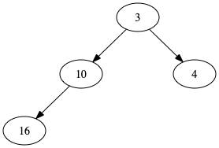
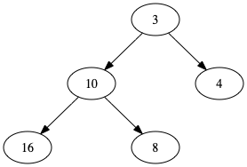
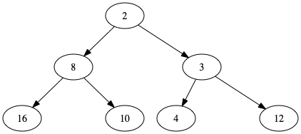
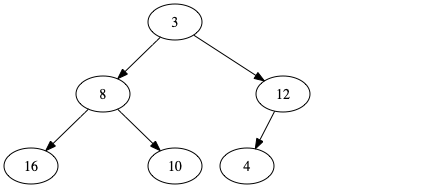
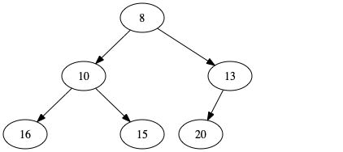
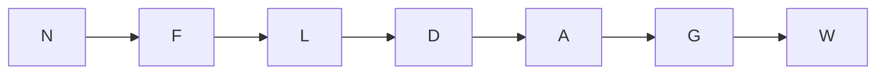
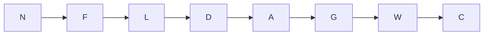
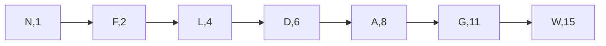
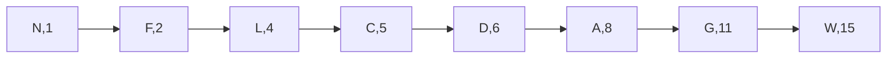

# Heaps and Priority Queues

## Overview

This is a "warmup" project, and covers material you should have
learned in CMSC132 and CMSC351. The goals are to ensure that you are:

 * familiar with the basic data structures on which we will
   build,
 * able to navigate git, and
 * able to upload your code to the grading server.
 
You will need to implement four classes:

 * `LinkedMinHeap.java`
 * `ArrayMinHeap.java`
 * `LinearPriorityQueue.java`
 * `MinHeapPriorityQueue.java`
 
If you are reading this on Gitlab, you will need to clone your own
copy, using either the HTTPS or SSH urls.  You can push your changes
back to Gitlab, which means you now have a remote backup. This has
several benefits:

 * If you ask a question on the discussion forum, we can see your
   code and provide a more precise response.
 * If your computer dies (which is going to happen to at least one
   person this semester, probably more), you have only lost the work
   you did since your last push.
 * If you want to work on multiple machines, it's as easy as pushing
   from one and pulling on the other. This is why git exists in the
   first place.

The starter code is in the `src/` directory, with the actual project
code in `src/pqueue/`. There is also JavaDoc in the `doc/` directory.
The code you need to modify is in `src/pqueue/heaps/` and
`src/pqueue/priorityqueues/`. You are welcome to add more directories,
files, and classes if you wish, but you are not required to.

## Prerequisites

We expect you to be familiar with Binary Search Trees, Stacks, Lists,
FIFO queues and programming in Java. Skills harnessed by a typical
UMD freshman course such as CMSC 131/132 are more than sufficient.
You will need to remind yourselves of what a binary heap is and how
insertions and min-deletions work, as well as the ways in which they
can be represented in computer memory. The structure and operation of
heaps are briefly touched upon in the next section.

In this class, we do not aim to test your programming, OOP or Java
expertise. We want to teach you Data Structures. However, a minimal
amount of familiarity with certain OOP/Java constructs will be
required. You would probably benefit from ensuring that you understand
the basics of Iterators and checked Exceptions. You should also be
familiar with what an interface is, what an anonymous inner class is,
how it differs from a functional interface, etc.

## A Brief Review of Heaps and Priority Queues

While we assume you are already familiar with these structures, we
will present a brief review, to refresh your memory.

### Heaps

#### Insertion

A *heap* is a complete binary tree (but *not* a complete binary search
tree). Insertions occur at the "leftmost" unoccupied space at the
leaf level. For example, in the diagram



we would add the next element below 10, to the right of 16. Let's
say we add 8 as the next value. This would then yield



However, heaps have another invariant: the subtree below an element
contains only elements that are greater than or equal to its value.
(Technically, this means we have a *minheap*. A *maxheap* would invert
this invariant.)
Because 8 is less than its parent 10, we need to *percolate* it
upwards.


8 is now less than or equal to all of the elements below it, and
greater than its parent 3. If we were now to insert 2, it would
become the first child of 4 (since the subtree under 8 is complete).


Again, this element is less than its parent (4), so it needs to
percolate upwards.


2 is still less than its parent (3), so we have to percolate again


#### Deletion

When deleting an element from the heap, we always delete the root element. Let's complete
the tree above as a starting point:



We then delete the root (2), and promote the *rightmost leaf* to be the new root:


This violates our invariant, but rather than percolate upwards from the insertion point,
we have to percolate *downwards* from the new root. We do this by percolating the new
element to the *lesser* of its children (which will be less than or equal to its former
sibling, which is now its child).



We continue this until the element we moved respects the invariant


#### Iteration

For our heap structures, we want to be able to visit all of the nodes
in ascending order. You will need to figure out how to do this while:

 * not modifying the backing structure (that is, the array or linked list), and
 * detecting changes to the backing structure during iteration, and throwing
   a `java.util.ConcurrentModificationException`.

#### Efficient Representation

Since heaps are complete binary trees, they can be implemented very efficiently
and compactly using an array. This is based on a breadth-first (level-order)
enumeration of the nodes in the heap.  This enumeration is exemplified as follows:



|  0  |  1  |  2  |  3  |  4  |  5  |
| --- | --- | --- | --- | --- | --- |
|  8  | 10  | 13  | 16  | 15  | 20  |

Note that the node at index $`i`$ has children at indices $`2i+1`$ and $`2i+2`$ (one
or two children might not even exist, of course), whereas the parent of index
$`i`$ (if it exists) is at index $`\lfloor \frac{i-1}{2} \rfloor`$.

The linked structure is what you will implement in `LinkedMinHeap`, and you will need
to implement the same data structure in this array form in `ArrayMinHeap`. Obviously,
you will need to modify not only how the data is represented in memory, but how the
percolation operations work. Since the functionality provided by these data structures
is identical, you can use the same unit tests you develop for the linked version when
testing the array version. All you should need to do is change the type referenced in the
tests.

### Priority Queues

The Priority Queue is an Abstract Data Type (ADT) with a very simple property:  Every
element to be enqueued is attached a certain positive integer priority, which predetermines
its order in the queue. By convention, smaller integers are considered "higher" in
terms of priority, such that, for example, priority 1 is considered a higher priority than
3.  Dequeueings only happen from the top of the queue, after which the element "before"
the first one will be available for immediate processing.  We see these kinds of queues all
the time in real life.

A simple FIFO (first-in, first-out) queue might look like



where N is the head of the queue. Adding a new element C works as we'd expect from 132:



A priority queue, by contrast, assigns a priority to each of these:



Now we're not just adding C, because it too has a priority (say it's 5). We would not
add C,5 at the end, because C has a higher priority (5) than W (15). Instead, we have
to insert it between L and D:



The obvious thing to do is to scan through the queue linearly until you find the
appropriate place for the new element. This is how you will implement
`LinearPriorityQueue`. This is inefficient, however ($`\mathcal{O}(n)`$), so you will
be implementing a second version, using a binary minheap (which you have already done
in this project!). This will be `MinHeapPriorityQueue`. Since minheaps are complete and
balanced, enqueuing and dequeueing should be $`\mathcal{O}(\log_2 n)`$. This makes minheap
a very good choice for implementing a priority queue.

#### Iteration

For our priority queues, we want to be able to visit all of the nodes
in priority-FIFO order. That is, the highest priority items should be returned
first, and for items of equal priority, they should be returned in FIFO order.
The same considerations hold for these iterators as for the heap iterators.

## General Notes on Iterators

You will need to review (in any Java reference):

* How to implement an iterator
* The difference between a *fail-fast* iterator and a *fail-safe* iterator

For your first project, you will need to:

* Implement **fail-fast** Iterators for your four classes.
* Implement the `next()` and `hasNext()` methods. (You don't need to implement the
 `remove()` method for this project, but may in the future.)
* This fail-fast iterator needs to throw a `java.util.ConcurrentModificationException` when appropriate.
* You also need to throw `NoSuchElementException` when appropriate.

Some observations about Iterators and `java.util.ConcurrentModificationException`:

* After you create an iterator, the iterator will return the elements in
  the data structure in some order every `next()` call (see the specifics for
  each type of data structure above). However, if you modify the data
  structure, it could mess up what the iterator `next()` will return because
  of the new elements. Therefore, we need  to specify the behavior of the
  iterator by specifying what kind of iterator to use.
* Fail-fast iterators will immediately report this potentially dangerous
  behavior by throwing a `java.util.ConcurrentModificationException`. The error condition is
  when you have an iterator created before some modification, and you attempt
  to use it again (calling `next()`, `hasNext()`, etc.) after the modification.
  Any modifications of a data structure invalidate all current iterators.


## Tips, Hints, and Guidelines

You may find these useful:

 * Familiarize yourself with the basics of `git`. There is a tutorial at
   https://gitlab.cs.umd.edu/mmarsh/git-tutorial, which was written for more git-heavy
   courses, but should still be useful.
 * Read the JavaDoc for the interfaces that you will be extending: `MinHeap` and `PriorityQueue`.
 * We strongly suggest that employ **test-driven development**, in which you develop your
   unit tests first to define the desired behavior, and then write your code so that it
   passes these tests.
 * For the data structures we've provided, read the source code and unit tests. This will help
   you design your implementation and develop your own tests.
 * Our tests will look at corner cases in the behavior of your implementation. You should try
   to develop thorough **stress tests** that test *all conceivable* inputs, including
   ones that are malformed. If your code should throw exceptions in certain (however unlikely)
   situations, make sure you are testing for those exceptions.
 * We've provided a `StudentTests` class with a number of unit tests. Take a look at this,
   because it might help you develop unit tests where exceptions are expected.
 * You may use any IDE you like. If you don't like Eclipse, feel free to use a different one.
   The Eclipse Course Management Plugin will not work for this course.
 * You will not *need* any of the functional programming features introduces in Java 8, but
   you might find them useful in testing. For example:
   ```java
   List<Integer> priorities = IntStream.range(1, MAX_PRIORITY + 1).boxed().
       collect(Collectors.toList());
   Collections.shuffle(priorities, r);
   ```
   is much simpler than the equivalent with `for` loops.
 * For a linked minheap, try writing out the elements ordered (starting
   with 1) in BFS order. Then convert these numbers to binary. Look for
   patterns that might help you with insertion and deletion.

## Submission and Grading

You will submit your code to the grading server as a zip file.
Credit will be awarded based on the number of tests that your code
passes.  Additionally, we will inspect your code to ensure that it
meets certain criteria:

 * `ArrayMinHeap` must use contiguous storage, whether an `ArrayList`, a `Vector`, or a raw array.
 * `MinHeapPriorityQueue` must use one of *your* minheap implementations.
 * You *may not* use built-in or third-party implementations of minheaps (or maxheaps) or
   priority queues.

You should use the ant `build.xml` file to create your zip file. If you have
ant installed, you can just run the command `ant`, and it will do what you
need. Many IDEs (such as Eclipse) have a built-in version of ant. To use it,
right-click on `build.xml` and run the ant build from the pop-up menu. There
are also `src/Archiver.java` and `src/AdvancedArchiver.java` classes, but
you should only use these as a last resort if the ant file doesn't work
for you. All of these mechanisms will omit the `.git` and `doc` folders, to
keep the zip (or jar) file smaller. All should be run from the top level
of the project repository (the parent directory of `src`).

You will not be able to see the test code, only the provided results.
We will use your highest-scoring submission before the deadline.
**No credit will be awarded for late submissions.**

We will run the similarity detection on all of the submissions. We
*will* catch any instances of plagiarism, and don't enjoy dealing
with the Office of Student Conduct any more than you do (we're very
busy).
