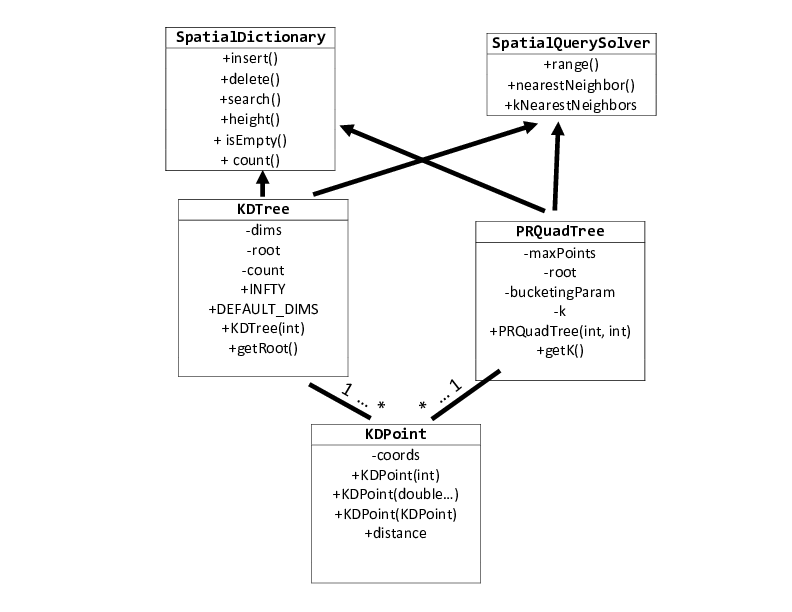
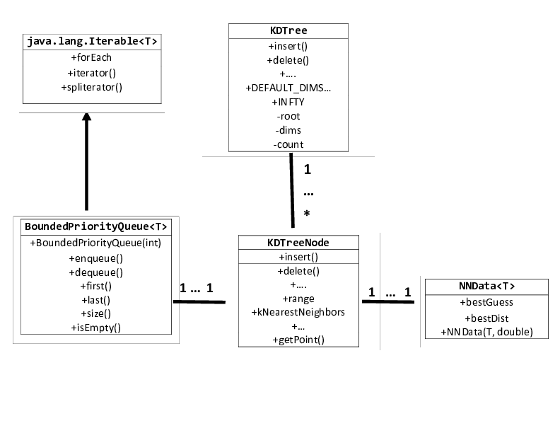
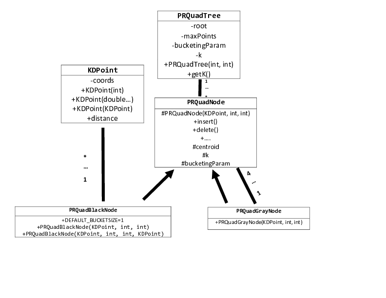

# KD-Trees and PR-QuadTrees

## Overview

In this project you will implement **KD-Trees** and **P-R
(Point-Region) QuadTrees**.  You will have to implement **both**
dictionary and spatial query functionality. You will be tested against
unit tests hosted on the grading server.

Half of this project is the study of spatial data structures and half
the practice of Object-Oriented Programming primitives, in particular,
*Inheritance* and *Polymorphism*.  You will need to spend some time
studying the provided documentation and code structure, in order to
understand how the various components are pieced together.

## What you need to implement

Everything you need to get started is included in this Git
repository. You will need to fill in the implementation of the
following 4 classes:

 * `spatial.knnutils.BoundedPriorityQueue`
 * `spatial.nodes.KDTreeNode`
 * `spatial.nodes.PRQuadBlackNode`
 * `spatial.nodes.PRQuadGrayNode`
 
The classes come with documentation in the `doc` directory, so that
you can see the full functionality exposed by the classes' `public`
interfaces. You are given the skeletons of the above classes, as well
as various other classes and interfaces, further described in the
following section.

## Code base

### Top level

This project can essentially be divided into two "mini-projects". It
doesn't matter which you implement first and which you implement
second, so we will just *arbitrarily* decide to call the **KD-Tree**
part of the project the **first** part, and the **PR-QuadTree** part of
the project the **second** part.

In this project, we supply you with a lot of code to use to build your
own. The following figure provides a bird's eye view of the project:

In the above figure, arrows denote an "is-a" relation, while regular
lines denote a "has-a" relation.

Both KD-Trees and PR-QuadTrees are **multi-dimensional
indices**. Since they are multi-dimensional indices, the first thing
they need to know is the **nature of the keys that they will store**.
The type of key stored is defined by the class
`spatial.kdpoint.KDPpoint`. To keep things simpler for this project,
the inner representation of `KDPoint` will be an array of `int`s.

Instances of `KDPoint` will appear in virtually **all of the methods**
that you will have to implement! You should study `KDPoint`
*extensively* to understand how it works.  In particular, notice that,
**since the internal buffer of `KDPoint` is exposed to the outside
world for convenience, a `KDPoint` is a mutable object!** This means
that you should **always** make **deep copies** of `KDPoint` instances
when you have to!  **No aliasing!** A copy constructor for `KDPoint`
is provided for you. You should also have a look at how extensive the
testing suite for `KDPoint` is, despite the apparent "simplicity" of
the class. You might get some ideas for testing your own classes by
looking at `KDPointTests.java`.

### KD-Tree and Bounded Priority Queue

The following figure show the structure of the first part of the project:

This figure shows the KD-Tree classes and "plug-ins" that allow for
spatial queries.  We provide the implementation of `KDTree` for you,
but note that all the work has been pushed to the `KDTreeNode` class
(under `nodes`), which you will have to implement. The next section
should clarify why the code is structured in this way.

`KDTreeNode` uses `BoundedPriorityQueue` *only* for the implementation
of $`m`$-nearest neighbor queries with $`m\geq 2`$. For 1-nearest
neighbor, it uses the simple `struct`-like class `NNData`. These types
are declared as parameters of the relevant methods of the classes
`KDTree` **and** `KDTreeNode`, so your project **won't compile**
against our tests if you don't have them **exactly where they are in
the code tree!**

For your implementation of `BoundedPriorityQueue`, you are given
**complete implementational freedom**.  That is, if you wanted to use
your own Priority Queue and adjust it to the semantics of a priority
queue bounded above, you can do this. If you want to extend Java's
built-in Priority Queue to do what you want it to do, that is **also**
fine with us. You do not even have to adhere to a **particular
implementation** of a Priority Queue: you can use a min-heap, an array
of lists made up of elements having the same priority, sorted by
insertion order, or anything else, as long as the implementation is
**correct** and provides **elementary** efficiency for `first()`,
`dequeue()`, `enqueue()`, and `last()`. By "elementary efficiency" we
essentially mean: *Don't make it so bad that the grading server will
hang.* Doing this would be a *major achievement* in its own right, and
we trust that we don't need to define it any further.  However, the
semantics of `BoundedPriorityQueue` are different from that of a
classic Priority Queue in that it limits the number of "best
neighbors" that a given `KDPoint` can have.  Consult the lecture
slides for more information on what we mean by that.

Note that your `BoundedPriorityQueue` will need to be `Iterable`, with
fail-fast iterators.

### PR-QuadTree

The following figure contains a UML diagram that shows the structure
of the second part of the project, which concerns the data structure
known as a **"Point-Region" (P-R) QuadTree**.

As with the class `KDTree`, the "central" class `PRQuadTree` is
provided to you. Your work is to implement the derived classes
`PRQuadGrayNode` and `PRQuadBlackNode`. Since **any node** in the
PR-QuadTree can **dynamically change status between black, gray, and
white node**, we need to deal with those nodes *polymorphically*: that
is, we want to call insertion and deletion routines that do the
**right thing *given the runtime class of the `PRQuadNode` instance
for which they are called!*** For this reason, we provide you with the
abstract class `PRQuadNode`, which provides the **common interface**
that we expect from **any** given node in a PR-QuadTree. In detail,
every node should have *some* way to

 * insert and delete a `KDPoint`,
 * query the node about the height of the subtree rooted at the node,
 * ask for the number of `KDPoint`s stored either in the node itself
   (if it's black) or **anywhere** in the (sub)tree **rooted** at the node
   (if it's gray).

Some points of interest:

 * You might wonder why there is no class `PRQuadWhiteNode` in the
   provided code base. This is because such a class would be
   **fundamentally useless**, since white nodes **don't really do or
   contain anything!** This means that one can model them adequately
   (and cheaply!) using a `null` reference. As always, you yourselves
   **absolutely can** use a separate class called, for example,
   `PRQuadWhiteNode` for your own purposes (such as debugging), if you
   want to. Remember: you should **not** alter the **existing** code
   base in **any** way, but **adding your own functionality** is
   **always** fine. The grading server unit test suites only care about
   what they can call, and what they can call is the `public` methods
   we need you to implement.

 * The base class `PRQuadNode` is made into an `abstract` class
   instead of an `interface` because it contains a `protected` data
   field of type `KDPoint`, which is called `centroid`, and another
   `int` field called `k`. Refer to their documentation to understand
   what they are useful for. In the Java programming language, one
   cannot have data fields in `interface`s. Every one of our nodes,
   irrespective of color, has a **geometrical interpretation**, since
   it models a certain quadrant of our space. As you think about the
   project, you might wonder why we have `centroid` and `k` as data
   types in the base class, instead of just in `PRQuadGrayNode`. You
   might initially think this because **it doesn't seem as if a
   `PRQuadBlackNode` actually uses any geometrical information**; it
   just stores `KDPoint`s. **We will not answer this question in the
   writeup**; it is for you to think about.

 * Because we are only storing integer coordinates, there is a minimum
   size for a region. If you need to split a region of this size, your
   code should throw a `CentroidAccuracyException`.

### Goodies

 * If you are using the `Archiver` class to generate archives, you
   might find that you have problems if you somehow have a large chain
   of "recursive" directory structures. If this happens, try using
   `AdvancedArchiver` or the `ant` build file `build.xml`, which you
   can run from the terminal by running `ant` in the top-level
   directory.
 * Take a look at `KDTree.treeDescription()` and
   `PRQuadTree.treeDescription()` for visualizations of your trees
   that you can generate. Those visualizations follow, more or less,
   the style of http://jimblackler.net/treefun/index.html

### Important note about implementation of spatial queries

It is **possible** to pass the relevant tests on the grading server by
implementing range and $`k`$-NN queries *naively*. That is to say, you
can pass a range query test by performing a Depth-First Traversal of
the tree, adding all points to a list, and then filtering out the
points that do **not** satisfy the query. For nearest neighbors, you
can perform a *sorting* of the list based on distance to the anchor
point and only keep the $`k`$ first elements.

We want to clarify that solving the spatial queries for either data
structure in this naive manner is **not** an acceptable method of
implementation. The entire point of the heuristic and branch-and-bound
approaches that we follow in class is that **huge swaths of a given
KD-Tree/PR-QuadTree can be avoided**. We want you to show us that you
can **implement these algorithms**, that you can finesse your way
around the recursive calls, make the appropriate checks, and disambiguate
between Mahattan and Euclidean distances. Everybody can do a DFS of a
tree and an insertion into a list; a CS420 student *can* and *should*
do better. We will be **manually** inspecting your submission to make
sure you follow these algorithms closely. Submissions that do **not**
follow these algorithms and instead perform a naive search of the tree
will **not** get **any** credit from the grading server tests that test
spatial queries.

It is also worth reminding you that our range and nearest-neighbor
queries explicitly **do not** include the anchor point of the query.
If you are searching for an anchor point $`p`$, and the only point
in the tree happens to be $`p`$, then the query should *fail*.

## Hints

 * For the KD-Tree component:

    * For deletions, consider the routine `findMin()` that we did in
      class. How can you use it to cover the special cases of
      deletion?

    * Consider the theory behind range and NN-Queries **before** you
      attempt to implement them. How do we behave in the
      descending/greedy phase? How do we behave in the
      ascending/pruning phase? What about the edge cases? How do we
      behave?

    * You can choose to leave the implementation of
      `BoundedPriorityQueue` implementation for after you implement
      `kNearestNeighbors()` if you wish, but realize that proper
      $`k`$-NN functionality depends on proper BPQ functionality.

 * For the PR-QuadTree component:

    * There are three types of students in this class. Those who study
      the parameter `PRQuadTreeNode.k` **well**, those who don't, and
      others.

    * In the backtracking phase of the range and nearest neighbor
      queries in a PR-QuadTree, while you **should** only recurse to
      quadrants which **intersect** with the given range (or current
      *worst* range, for $`k`$-NN), you should **not** be prioritizing
      the quadrants by the area of intersection; instead, keep it
      simple and loop through only the **valid** quadrants in
      **Z-order**. Finding the area of intersection is a hard
      numerical problem which we will not solve in this project.

   * Speaking of intersection of a quadrant with a given range, check
     the `protected` method
     `PRQuadNode.doesQuadIntersectAnchorRange()`. It might be useful
     to you.
